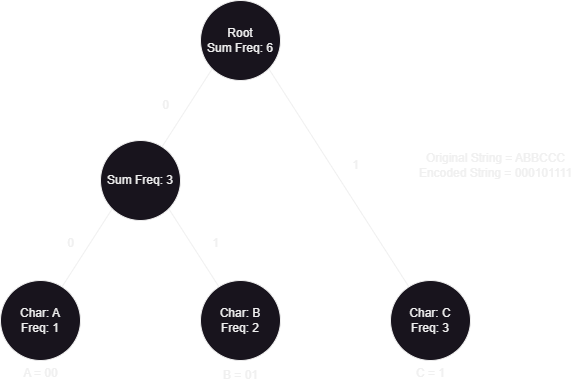
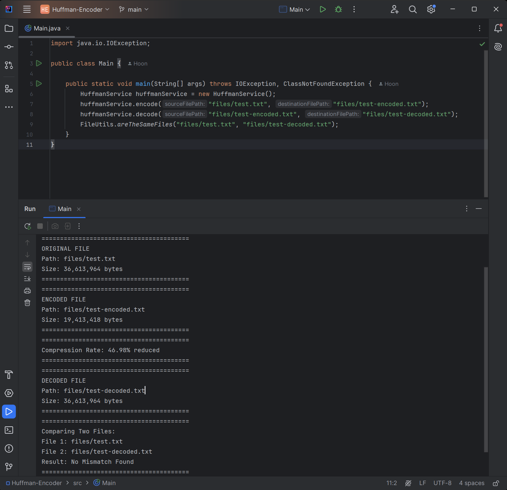

# Text File Compressor Using Huffman Coding Algorithm

This project is to compress & decompress text files using Huffman Coding Greedy Algorithm

## Features

- This application decode & encode text contents using Huffman Coding
- The Java console displays sizes of original, compressed, decompressed files, compression rate, and checks if the contents of the original file & the decompressed file are the same
- The compressed file contains encoded contents of the original file & some metadata (i.e. Huffman Tree, length of encoded string) for decompression process
- This application reduces ~47% size of the original text file

## Input Arguments
- [source_text_file_path] [compression_option] [destination_text_file_path]
- compression option
  - -e: encode
  - -d: decode
- example: files/file.txt -e files/encoded_file.txt

## Used Data Structures, Algorithms and others
- Hash Map
- Min Heap
- Bit Set
- Binary Tree
- Tree In-Order Traversal
- Regular Expression

## Project and Huffman Coding Algorithm Implementation
- Encode Implementation
1. Read a text file to encode
2. Create a hashmap and count the number of occurrences of each character in the file
3. Instantiate a node from a class, which has a character and its frequency, left node and right node as a tree node, and push it into a min heap
4. Repeat step #3 for all other characters from the hashmap
5. Pop two objects from the heap (which has the least frequencies), create a new node and set this node as a parent of the two nodes
6. Push the new parent node into the heap
7. Repeat step #5 and #6 until the heap has only one node, which becomes a root of the tree
8. Create another hashmap, which contains information about a character and encoded value, which will be a string representation of a binary number
9. Perform inorder traversal from the root, and when travelling to left child, mark 0, otherwise, mark 1
10. when reached to the leaf node, get the character of the leaf node, and put it into the encode hashmap with the binary string
11. Repeat step #9 and #10 until all the leaf nodes are visited
12. Encode a string representing binary numbers from the string from the original file
13. Convert the encoded binary string to bitset
14. Save the tree and the bitset to a new file

- Decode Implementation
1. Read the tree object and the bitset from the encoded file
2. Loop throw each bit in the bitset, and traver the tree with the value of the bit. For example, 0 -> left child, 1 -> right child
3. when reached to the leaf node, add the character of the node to a string builder
4. when all the bits are read, write the string from string builder to a file

- Example: if the original string is ABBCCC, then we can create a tree, such as:

## Tech Used

## Screenshots

- Application Run
  

## Challenges

- In this project, Huffman Encoding generates binary String, which was actually larger than the content of original file
- For example, when we get a Huffman code table during the encoding process as below: 
  - Character | Huffman Code
    ------------- | -------------
    A  | 100
    B  | 101
    C  | 11
    D  | 0
- Then String ABBCCCDDDD is encoded to:
  - 1001011011111110000
- And this result is larger than the original string ABBCCCDDDD
- Even though this looks like a binary number, but it is still a string where each character is 2 bytes(= 16 bits)
- To solve this issue, this application uses BitSet, which is a collection of boolean where each boolean is 1 bit, 
- And it writes the BitSet object into a file using Java IO's ObjectOutputStream, which results in reduced size of the encoded contents of the original file 
  
